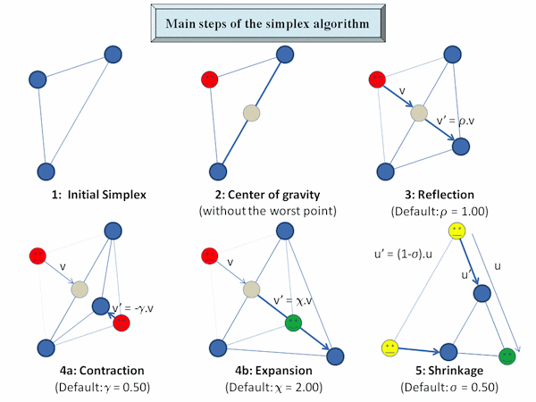
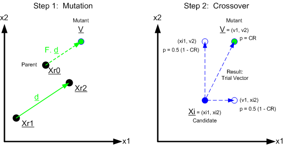

Location Optimization in R
========================================================

Harlan D. Harris and Alan Briggs

Summary: This document walks through several ways of optimizing locations
in R, given ZIP code data about peoples' home and work. Techniques include
mapping with the `rmaps` package (alpha!), continuous optimization with `optim`,
and global optimization with the `DEoptim` package.

For more information, see the [GitHub repository](https://github.com/HarlanH/loc-opt-demo).

```{r setup, echo=TRUE}
library(knitr)
opts_chunk$set(fig.width=7, fig.height=5, echo=TRUE, cache=TRUE, autodep=TRUE)

options(stringsAsFactors=FALSE)

suppressPackageStartupMessages(library(ggplot2))
library(zipcode)
library(plyr)
library(compiler)
#suppressPackageStartupMessages(library(ggmap))
#suppressPackageStartupMessages(library(mapproj))
suppressPackageStartupMessages(library(DEoptim))
suppressMessages(library(rMaps))
library(munsell) # for colors
```

Setup
-----

First, load the ZIP code data, filtering out weird values and such. Then,
add ZIP code information, including ZIP centroid latitude and longitude.

```{r loading}
dat <- subset(read.csv('NYOSP_Locations.csv', colClasses='character'), select=c(Home.Zip, Work.Zip))
dat <- rename(dat, c('Home.Zip'='home_zip', 'Work.Zip'='work_zip'))

data(zipcode)
home_zip <- zipcode
names(home_zip) <- paste0("home_", names(home_zip))
work_zip <- zipcode
names(work_zip) <- paste0("work_", names(work_zip))

dat <- join(dat, home_zip, by='home_zip')
dat <- join(dat, work_zip, by='work_zip')

times_square <- c(40.7577, -73.9857) # lat, long
dat <- subset(dat, (abs(home_latitude - times_square[[1]]) < 2.0 & 
             abs(home_longitude - times_square[[2]]) < 2.0) |
            (abs(work_latitude - times_square[[1]]) < 2.0 & 
             abs(work_longitude - times_square[[2]]) < 2.0))
dat <- subset(dat, !is.na(home_latitude))

head(dat)
```

1. Simple Statistics for Locations
----------------------------------

A simplest approach would be to find modal, mean, and median work locations.

```{r simple}

# get the most common work zip code
simple_mode <- names(which.max(table(dat$work_zip)))
# then look up in the previously-pulled list of work zip codes
simple_mode <- unlist(work_zip[work_zip$work_zip==simple_mode, 
                               c('work_latitude', 'work_longitude')])

# median's simpler...
simple_median <- c(median(dat$work_latitude, na.rm=TRUE),
                   median(dat$work_longitude, na.rm=TRUE))

# trim 10% from each edge of the work locaitons, then mean of that
simple_trim_mean <- c(mean(dat$work_latitude, na.rm=TRUE, trim=.1),
                      mean(dat$work_longitude, na.rm=TRUE, trim=.1))

sum_work_locs <- data.frame(type=c('Modal', 'Median', 'Trimmed Mean'),
                       lon=c(simple_mode[[2]],
                             simple_median[[2]],
                             simple_trim_mean[[2]]),
                       lat=c(simple_mode[[1]],
                             simple_median[[1]],
                             simple_trim_mean[[1]]))

print(sum_work_locs)
```

It would be even more useful to put those locations on a map.

2. Mapping Locations
--------------------

Generate functions to work with
maps. We're now using the brand-spanking-new 
[rMaps](https://github.com/ramnathv/rMaps) package
that lets us draw fancy-pants Leaflet maps!
First, plot summary statistic locations on the map.

```{r map, results='asis'}


mk_marker <- function(lat, lon, name) {
    list(type='Feature',
         properties=list(name=name, popupContent=name),
         geometry=list(type='Point', coordinates=c(lon, lat)))
}

map_with_markers <- function (latlontype, map, center=times_square, zoomlevel=11) {
    map <- Leaflet$new()
    map$setView(center, zoom = zoomlevel)
    map$tileLayer(provider = 'Stamen.Toner')
    markers <- dlply(latlontype, 1, function(row) with(row, mk_marker(lat, lon, type)))
    names(markers) <- NULL # so converter creates a list
    map$geoJson(markers,
        onEachFeature='#! function (feature, layer) {
          layer.bindPopup(feature.properties.popupContent);
        } !#')      
    map
}

map_with_markers(sum_work_locs)


```

You're not doing that bad, as it turns out.

3. Computing Distances and Costs
--------------------------------

We've got lats and lons, but we live on a sphere, so we need to write/steal
some convenience functions. This is the point-to-point distance from the
`fossil` package, and a vectorized version.

```{r dists}
#distance in kilometers between two long/lat positions (from "fossil" package)
earth.dist <- function (long1, lat1, long2, lat2) 
{
    rad <- pi/180
    a1 <- lat1 * rad
    a2 <- long1 * rad
    b1 <- lat2 * rad
    b2 <- long2 * rad
    dlon <- b2 - a2
    dlat <- b1 - a1
    a <- (sin(dlat/2))^2 + cos(a1) * cos(b1) * (sin(dlon/2))^2
    c <- 2 * atan2(sqrt(a), sqrt(1 - a))
    R <- 6378.145
    d <- R * c
    return(d)
}
earth.dist.o <- cmpfun(earth.dist) # make it a bit faster
```

Define a simple point-to-point cost function, then calculate the costs
of some recent venues for NYOSP, and plot on a map.

```{r costfn}
# df must have cols work_longitude and work latitude
# lon and lat must be scalars
# scale just scales the units
# x=2 is cartesian distance
p2p_cost <- function(df, lon, lat, scale=100,x=2) {
    sum((earth.dist.o(df$work_longitude, df$work_latitude, lon, lat)/scale)^x, na.rm=TRUE)
}

# How good or bad are recent locations, for optimizing vs people's work
# locations?
## Recent locations: 
venues <- data.frame(name=c('pivotal', 'aol', 'columbia'),
                     lat=c(40.7403372,40.7308948,40.8074358),
                     lon=c(-73.9951462,-73.9917096,-73.9625858))

p2p_venue_costs <- ddply(venues, .(name, lat, lon), 
                         function(vv) data.frame(cost=p2p_cost(dat, lon=vv$lon, lat=vv$lat)))

# 
print(p2p_venue_costs)
```


```{r costfn_map, results='asis'}
mk_circle <- function(lat, lon, color) {
    list(type='Feature',
         properties=list(color='black', fillColor=mnsl(sprintf("5PB %d/10", color), fix=TRUE)),
         geometry=list(type='Point', coordinates=c(lon, lat)))
}

plot_with_circles <- function(latloncost, center=times_square) {
  map <- Leaflet$new()
  map$setView(center, zoom = 10)
  map$tileLayer(provider = 'Stamen.Toner')
  
  latloncost$cost_color <- with(latloncost, 
                                9-round(8*sqrt((cost-min(cost))/(max(cost)-min(cost)))))
  markers <- dlply(latloncost, 1, function(row) with(row, mk_circle(lat, lon, cost_color)))
  names(markers) <- NULL # so converter creates a list
  map$geoJson(markers,
      pointToLayer='#! function (feature, latlng) {
          return L.circleMarker(latlng, {
      radius: 8,
      color: feature.properties.color,
      fillColor: feature.properties.fillColor,
      weight: 1,
      opacity: 1,
      fillOpacity: 0.8
  });
      } !#')
     
  map

}

plot_with_circles(p2p_venue_costs)

```

The cost function is based on the sums of the point-to-point distances between 
the target point and each of the work locations:

$$ \operatorname{cost} = \sum_{\operatorname{workloc}} d(p, \operatorname{workloc}) $$

where $d$ is distance-on-a-sphere, which in this case is extremely close to Euclidean distance.

Technical note: The sum of convex cost functions is provably convex.

To compute distance to a _commute_, we need to use the "point to line
segment" distance calculation, or "point to point" if only one 
location was provided (unemployed, work at home, classified). 

```{r plot_commutes, results='asis'}

mk_commuteline <- function(lat1, lon1, lat2, lon2) {
    if (is.na(lat2)) {
        list(type='Feature',
         geometry=list(type='LineString', coordinates=list(c(lon1, lat1), c(lon1, lat1))))
    } else {
        list(type='Feature',
         geometry=list(type='LineString', coordinates=list(c(lon1, lat1), c(lon2, lat2))))
    }
}

plot_with_linesegs <- function (lat1, lon1, lat2, lon2, center=times_square, fn=mk_commuteline) {
  map <- Leaflet$new()
  map$setView(center, zoom = 10)
  map$tileLayer(provider = 'Stamen.Toner')
  
  commute_lines <- llply(seq_along(lat1), function(i) fn(lat1[[i]], lon1[[i]],
                                                         lat2[[i]], lon2[[i]]))
  names(commute_lines) <- NULL # so converter creates a list
  map$geoJson(commute_lines, style=list(color="#ff5800", weight=5, opacity=0.65))
  
  map
}

with(dat, plot_with_linesegs(home_latitude, home_longitude, work_latitude, work_longitude))

```

Skip the somewhat slow surface-of-a-sphere
distance now, and just use a simpler Euclidean distance.

```{r commute_cost}
# p-norm computation. p = 2 is cartesian
dist <- function(a,b,c,d, p=2) {
    (abs(a-b)^p + abs(c-d)^p)^(1/p)
}
dist.o <- cmpfun(dist)

# distance from lon/lat to the df with four column names specified in cols
# as (end1_x, end1_y, end2_x, end2_y), where end2 may be missing.
# returns a vector of costs.
p2ls_cost_v <- function(df, cols, lon, lat, p=2, km_per_degree=69.11) {
    stopifnot(length(cols) == 4)
    stopifnot(all(cols %in% names(df)))
    stopifnot(length(lon) == 1)
    stopifnot(length(lat) == 1)
    
    #http://stackoverflow.com/questions/849211/shortest-distance-between-a-point-and-a-line-segment
    
    # convert from lat/lon to flat coordinates, using the lat/lon ratio at the point in question
    param_x = lon * km_per_degree * cos(lat)
    param_y = lat * km_per_degree
    home_x = df[[cols[[1]]]] * km_per_degree * cos(lat); home_y = df[[cols[[2]]]] * km_per_degree
    work_x = df[[cols[[3]]]] * km_per_degree * cos(lat); work_y = df[[cols[[4]]]] * km_per_degree
    
    # first, get the home distances
    home_dists <- dist.o(home_x, param_x, home_y, param_y, p)
    
    # then, get the distances to the line segment, which may be NA
    # length of the segment (squared)
    l2 <- (home_x - work_x)^2 + (home_y - work_y)^2
    # position of closest point on line
    t <- (param_x - home_x) * (work_x - home_x) + 
         (param_y - home_y) * (work_y - home_y)
    t <- t / l2
    proj_x <- home_x + t * (work_x - home_x)
    proj_y <- home_y + t * (work_y - home_y)
    seg_dists<- ifelse(t < 0, 
                       home_dists,
                       ifelse(t > 1,
                              dist(work_x, param_x, work_y, param_y, p),
                              dist(proj_x, param_x, proj_y, param_y, p)))

    ifelse(is.na(seg_dists), home_dists, seg_dists)
}
p2ls_cost_v.o <- cmpfun(p2ls_cost_v)

# wrapper function for convenience
p2ls_cost <- function(df, lon, lat, p=2) {
    sum(p2ls_cost_v.o(df, c("home_longitude", "home_latitude", "work_longitude", "work_latitude"), lon, lat, p))
}
```

Now, plot the costs of recent venues on a map, using point-to-line-segment.

```{r p2ls_examples}
p2ls_venue_costs <- ddply(venues, .(name, lat, lon), 
                         function(vv) data.frame(cost=p2ls_cost(dat, lon=vv$lon, lat=vv$lat)))

print(p2ls_venue_costs)

```

```{r p2ls_examples_map, results='asis'}
plot_with_circles(p2ls_venue_costs)
```

Interestingly, with point-to-line-segment (commute) cost, 
Pivotal is a lot better than AOL, whereas with point-to-point
(work location) cost, Pivotal was only slightly better than AOL.
Columbia's not great in either case. Looks the same on the map.

4. Mapping Single-Point Costs
-----------------------------

Pictures are worth many words. 
Iterate over a grid to get costs for various locations, then plot.

```{r p2ls_cost}

grd <- expand.grid(lat=seq(from=times_square[[1]]-.1, to=times_square[[1]]+.1, length.out=31),
                        lon=seq(from=times_square[[2]]-.1, to=times_square[[2]]+.1, length.out=31))
grd <- adply(grd, 1, 
              function(rr) data.frame(cost=p2ls_cost(dat, rr$lon, rr$lat)))
grd$goodness <- 1-(grd$cost/max(grd$cost))
#grd_json <- rjson::toJSON(rCharts::toJSONArray2(grd[,c('lat','lon','goodness')], json = F, names = F))

```

```{r p2ls_cost_map, results='asis'}
# TODO: make this better!

map <- Leaflet$new()
map$setView(times_square, zoom = 10)
map$tileLayer(provider = 'Stamen.Toner')

markers <- alply(grd, 1, function(row) with(row, mk_circle(lat[[1]], lon[[1]], round(goodness[[1]]*10))))
names(markers) <- NULL # so converter creates a list
map$geoJson(markers,
    pointToLayer='#! function (feature, latlng) {
        return L.circleMarker(latlng, {
    radius: 8,
    color: feature.properties.color,
    fillColor: feature.properties.fillColor,
    weight: 1,
    opacity: 1,
    fillOpacity: 0.8
});
    } !#')

map
```

The pretty maps show that downtown is the best place for a Meetup. </obvious>

5. Optimizing Single Points
---------------------------

Use relatively simple Nelder-Mead optimization to find optimal cost. 



Is it the global optimum? Seems to be -- multiple runs with different
initial conditions give the same result. (I've separately run many times,
not just the few shown here.) The individual cost functions
are not quite convex (all points on the line segment are optima), but it
may be that the sum is in practice, at least if you start in a reasonable
neighborhood.

```{r simple_p2ls_optim}
# wrap for optim()
p2ls_cost_opt <- function(params) {
    p2ls_cost(dat, params[[1]], params[[2]])
}

starting_points = alply(venues, 1, function (rr) c(rr$lon, rr$lat))
# call optim, which defaults to Nelder-Mead/Simplex
one_loc <- llply(starting_points, function(sp) optim(sp, p2ls_cost_opt, control=list(trace=0)))
print(laply(one_loc, function(ol) ol$par)) # all the same!

single_p2ls_optim = list(x=one_loc[[1]]$par[[1]], y=one_loc[[1]]$par[[2]])

```

```{r simple_p2ls_optim_map, results='asis'}
# show the single optim vs the historical venues
map <- plot_with_circles(p2ls_venue_costs)
map$marker(c(single_p2ls_optim$y, single_p2ls_optim$x), bindPopup = 'optimal')

map
```

6th Ave, 25th St! What's there? 2 Brothers Pizza! (natch)

6. Computing N-Point Costs
--------------------------

If there are multiple locations, define the cost to be the _minimum_ cost, 
for each person, to get to any location from their commute.

$$ \operatorname{cost} = \sum_{\operatorname{person}} min_{\operatorname{loc}_i} d(\operatorname{loc}_i, \operatorname{commute}_{\operatorname{person}}) $$

```{r npoint} 
colnames <- c("home_longitude", "home_latitude",
          "work_longitude", "work_latitude")
p2lsN_cost <- function(dat, latlons, p=2) {
    # for each pair of latlons, calc p2ls_cost
    costs <- laply(1:(length(latlons)/2), 
                   function(i) p2ls_cost_v.o(dat, 
                                               colnames, 
                                               latlons[[i*2-1]], latlons[[i*2]], 
                                               p))
    sum(aaply(costs, 2, min))
}
p2lsN_cost.o <- cmpfun(p2lsN_cost)
p2lsN_cost_opt <- function(latlons) {
    p2lsN_cost.o(dat, latlons)
}

# get cost for two example triples of locations
venue_triple <- unlist(dlply(venues, 1, function(rr) c(rr$lon, rr$lat)))
tri1_cost <- p2lsN_cost_opt(venue_triple)
tri2_cost <- p2lsN_cost_opt(unlist(c(venue_triple[1:4], single_p2ls_optim$y, single_p2ls_optim$x)))
```

```{r show_npoint, results='asis'}
map <- Leaflet$new()
map$setView(times_square, zoom = 10)
map$tileLayer(provider = 'Stamen.Toner')

mk_polygon <- function(lats, lons) {
    stopifnot(length(lats)==length(lons))
    coord_list <- llply(seq_along(lats), function(i) c(lons[[i]], lats[[i]]))
    list(type='Feature',
     geometry=list(type='Polygon', coordinates=coord_list))
}
polygons <- mk_polygon(venues$lat, venues$lon)
map$geoJson(list(polygons)) #, list(style=list(color="#ff7800", weight=5, opacity=0.65)))
# throwing very weird error!
map
```

The three _past_ locations are substantially better in the 3-location cost 
function (`r tri1_cost`, blue) than the 1-location optimum plus two other 
downtown locations (`r tri2_cost`, red)! Having Columbia in the mix definitely
makes attendance easier for some people.

7. Local Minima in N-Point Optimization
---------------------------------------

We want to use the new 3-point-to-line-segment cost function
to find 3 optimal locations. Now, I'm using the "L-BFGS-B" algorithm, which
is an iterative quasi-Newton algorithm that supports bounds on the
parameters. 

```{r boundingboxen}
# constrain the points to be not too far from DC
lower_box <- rep(c(times_square[[2]]-.5, times_square[[1]]-.5), 3)
upper_box <- rep(c(times_square[[2]]+.5, times_square[[1]]+.5), 3)

```

```{r localminima1}
# this takes 5-10 minutes for 10 runs... But only need a few to see the issue.
set.seed(1) 
nruns=5

starting_points = rlply(nruns, function(i) venue_triple + rnorm(6, sd=.2))
three_loc <- llply(starting_points, 
                   function(sp) optim(sp, cmpfun(p2lsN_cost_opt), 
                                      method="L-BFGS-B",
                                      lower=lower_box, upper=upper_box,
                                      control=list(trace=1)))

```

I'll refer you to [Wikipedia's entry on BFGS](http://en.wikipedia.org/wiki/BFGS_method) for a technical
overview. Roughly (as I understand it):

1. At any given point, you can measure the local curvature of the surface.
2. Based on your current estimate of the curvature of the surface, use trial-and-error to
  find a good distance to go in the seemingly-best direction.
3. Update your estimate of the curvature of the surface based on how far you moved and how the local
  curvature changed.

L-BFGS is memory-efficient in high-dimensional spaces, at the cost of some precision. L-BFGS-B
adds low/high constraints on each dimension.

To see if there are local minima, run a few times with different starting points.
Plot the triangles found in each run on top of each other. Uh oh.

```{r localminima2}
three_loc_pars <- laply(three_loc, function(ol) ol$par)
print(three_loc_pars)


# TODO
# # turn these into a set of triangles and plot them
# ids <- factor(1:nruns)
# values <- data.frame(id=ids, value=laply(three_loc, function(x) x$value))
# positions <- data.frame(id = rep(ids, each=3),
#                         x=as.vector(t(three_loc_pars[,c(1,3,5)])),
#                         y=as.vector(t(three_loc_pars[,c(2,4,6)])))
# datapoly <- merge(values, positions, by="id")
# make_map(dc.maps[[2]]) + 
#     geom_polygon(data=datapoly, aes(x=x,y=y,color=value,group=id), alpha=.1, size=2) +
#     scale_color_continuous(low="blue", high="red")
```

It found a variety of points with each initial starting point. Not good. Let's throw some
horsepower at this to be more confident of a global solution.

8. Global N-Point Optimization
------------------------------

Use Differential Evolution, an algorithm that uses quasi-Darwinian 
evolution of populations of candidate solutions, with Nelder-Mead-like
gradient heuristics at each generation, to (likely) find the global optimum.

```{r deoptim}
# Could use the historical points as starting points, but it turns out not to
# be a good enough location to matter much, so letting the algorithm pick
# random points in the bounding box instead.

# This takes a few minutes. 
# NP should be at least 60, itermax seems to converge around 100 or so,
# and strategy doesn't seem to make much difference for this decision
# surface.
three_loc_de <- DEoptim(cmpfun(p2lsN_cost_opt), lower=lower_box, upper=upper_box,
                     control=list(trace=TRUE, NP=100, itermax=200, strategy=3))
                         #NP=200, itermax=300, trace=TRUE, 
                         #         strategy=2, c=.5, VTR=362, reltol=.0001, steptol=25))
# get a copy of coffee...
# Note that not using parallel because running on a Mac in an R console...
```

Here's a nice illustration of the simplest version of the algorithm, 
from [a blog post](http://beyondtheblueeventhorizon.blogspot.com/2011/04/differential-evolution-optimization.html).



9. Mapping N-Point Solutions
----------------------------

Show the DE convergence, and the global optimum on maps. The global optimum is,
roughly, Downtown + Rockville + Southern Arlington.

```{r deoptim_plots1}
# DEoptim bug makes plot.DEoptim not work right -- do it by hand
iter_values <- three_loc_de$member$bestvalit[1:three_loc_de$optim$iter]
qplot(seq_along(iter_values), iter_values)

```
```{r deoptim_plots2, results='asis'}
map <- Leaflet$new()
map$setView(times_square, zoom = 10)
map$tileLayer(provider = 'Stamen.Toner')
best_pts <- three_loc_de$optim$bestmem
for (i in c(1,3,5)) {
    map$marker(as.vector(best_pts[(i+1):i]), bindPopup='')
}
# TODO: Leaflet divIcon??
map

```

And we're done with the demo!

10. Possible Fun Extensions
---------------------------

In roughly easiest-to-hardest order.

* Change the cost function to use Manhattan distance (p=1) instead of Euclidean 
  distance (p=2). Find the single-location optimum location.

* Change the cost function (`p2ls_cost_opt`) to be the mean of the two best 
  point-to-line-segment costs, instead of just the single best. How does this change the 
  best 3-location optimum?
  
* Try another global optimization method, such as simulated annealing.

* Profile this R code, find out why it's slow, and fix it. Supporting multicore 
  would be low-hanging fruit.

* Is there a variant of the cost function in the 3-location problem that's 
  convex, allowing faster optimization?  
